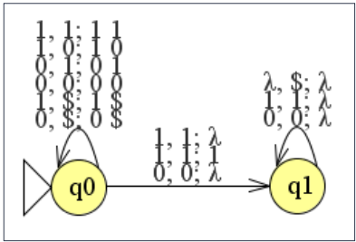
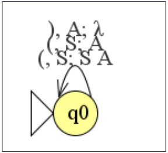
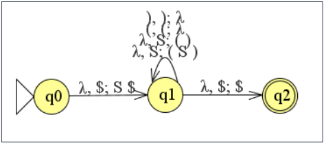
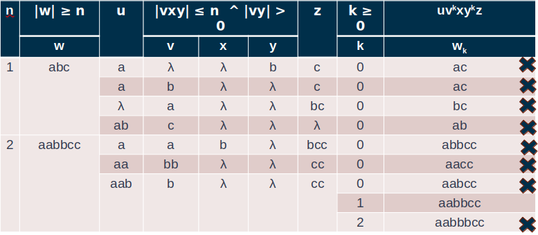
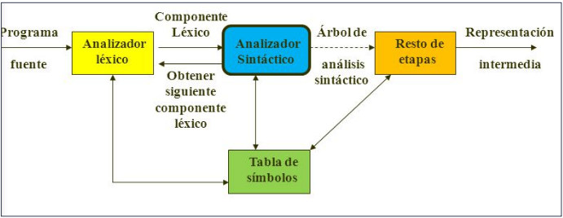

# Autómata de Pila (AP)

## Definición LIC

* Es un tipo de LF.
* Generado por una GIC o Gramática de tipo 2.
* Ejemplos: expresiones aritméticas, sentencias de un lenguaje de programación, etc.

## Definición AP

* Conocidos como autómatas “push-down”
* Permiten analizar palabras para reconocer si pertenecen o no a LIC.
* Tienen la misma estructura que los AF, pero se les agrega una pila (memoria auxiliar con método LIFO) para poder guardar información que podrá ser útil en momentos posteriores del análisis.
* Más poderosos que los AF, porque además de reconocer a los LR tienen la capacidad de reconocer a los LIC.
* Por ejemplo: balanceo de paréntesis (por cada paréntesis de apertura debe existir posteriormente un paréntesis de cierre).
* Este aspecto es imposible de controlar con un AF.
* Los AP, al disponer de memoria auxiliar (pila), pueden introducir en ella un elemento en la pila por cada paréntesis de apertura leído, e ir eliminando de la pila un elemento por cada paréntesis de cierre leído, y, por tanto, llevar el control de sí se han cerrado todos o no.

## Definición formal

* Formalmente un autómata de pila se define como una 7-upla: M = <Σ, Ґ, Q, q0, p0, F, δ>
  * Σ:  alfabeto (conjunto finito de símbolos) de la cadena de entrada.
  * Ґ: alfabeto (conjunto finito de símbolos) de pila. Puede tener símbolos en común con Σ. (Algunos autores Σ ∩ Ґ = Ø)
  * Q:  conjunto finito de estados.
  * q0: estado inicial. q0 ∈ Q.
  * p0: símbolo inicial de pila, que aparece en el tope de la pila. p0 ∈ Ґ. Ejemplo: $, #, Z0
  * F:  conjunto de estados finales o estados de aceptación. F ⊆ Q.
  * δ:  función de transición entre estados. Se define: δ: Q x Σ U {λ} x Ґ -> Q x Ґ*

* Por cada estado, símbolo de entrada o palabra vacía (λ), y símbolo en el tope de la pila, determina la transición a otro estado y decide que se debe escribir en la pila.
* La pila puede encontrarse o no inicializada con el símbolo inicial de pila (también llamado distinguido), es decir, cuando la pila está vacía se puede leer en su tope el valor de p0.

## Ejemplo AP

* L = {1^n 0^n / n ≥ 1}


| TM | 1 | 0  | λ |
| -- | -- | -- | -- |
| >q0,$ | (q0,1$)| - | - |
| q0,1 | (q0,11) | (q1,λ) | - |
| q1,$ | - | -  | (q1,λ) |
| q1,1 | - | (q1,λ) | - |

* Σ = {0, 1}
* Ґ = {$, 1}
* Q = {q0, q1}
* q0 = q0
* p0 = $
* F = {}
* δ = {δ(q0,1,\$)=(q0,1$), δ(q0,1,1)=(q0,11), δ(q0,0,1)=(q1,λ), δ(q1,0,1)=(q1,λ), δ(q1,λ,$)=(q1,λ)}

## Funcionamiento

* Cuando recibe un 1 en la entrada y está en el estado q0, pone el 1 en la pila, para memorizar cuantos ha leído.
* Cuando lee un 0, transita al estado q1 que se dedica a eliminar un 1 de la pila por cada 0 que lee.
* Así, si la pila se queda vacía es porque ha leído el mismo número de unos que de ceros.

* Entrada: 111000

| Pila | Entrada |
| -- | -- |
| $ | 111000 |
| $1 | 11000 |
| $11 | 1000 |
| $111 | 000 |
| $11 | 00 |
| $1 | 0 |
| $ | |
| | |

## Tipos de transiciones

* El AP tiene dos tipos de transiciones:
  * **Cuando lee un símbolo de la entrada**, a ∈ Σ, si está en el estado q ∈ Q, hay un símbolo en el tope de la pila Z ∈ Ґ, y la función de transición para esa terna, es:
    * δ(q, a, Z) = {(q1, z1), (q2, z2), ... ,(qn, zn)}, (qi ∈ Q, zi ∈ Ґ*)
    * Entonces transita a uno de los estado qi, se saca de la pila el símbolo Z, se pone en el tope de la pila los símbolos que formen parte del zi correspondiente, y se sitúa la cabeza de lectura en el siguiente símbolo de la entrada.
  * **Cuando no se lee ningún símbolo de la entrada**, si está en el estado q ∈ Q, hay un símbolo en el tope de la pila Z ∈ Ґ, y la función de transición para la terna, es:
    * δ(q, λ, Z) = {(q1, z1), (q2, z2), ... ,(qn, zn)}, (qi ∈ Q, zi ∈ Ґ*)
    * Entonces transita a uno de los estado qi, se saca de la pila el símbolo Z, se pone en el tope de la pila los símbolos que formen parte del zi correspondiente, y no se mueve la cabeza de lectura de la entrada.

## Descripción instantánea

* Permite describir la configuración del AP en cada momento.
* Es una terna (q, x, z), q ∈ Q, x ∈ Σ*, z ∈ Ґ*.
* Contiene el estado actual, el resto de la palabra de entrada que queda por leer, y la situación de la pila en ese instante.
* El primer símbolo de la palabra de entrada representa el puntero de lectura de la cinta de entrada, y el primer símbolo de la pila representa el tope de la pila.
* Ejemplo:
  * momento inicial: (q0, 1100, $)
  * siguiente: (q0, 100, 1$)  
  * final: (q1, λ, λ)

## Movimientos

* Si (p, x) ∈ δ(q, a, Z), con p, q ∈ Q, a ∈ Σ U {λ}, Z ∈ Ґ, x ∈ Ґ*
* Entonces, de la descripción instantánea (q, ay, ZX), se puede pasar a la descripción instantánea (p, y, xX), representándose como: (q, ay, ZX) ├ (p, y, xX)
* Ejemplo: (q0, 1100, $)├ (q0, 100, 1$)├ (q0, 00, 11$)├ (q1, 0, 1$)├ (q1, λ, $)├ (q1, λ, λ)

## Sucesión de movimientos

* Para representar el hecho de que se puede alcanzar la descripción instantánea d2 a partir de la d1, se utilizará la siguiente notación: d1 ├* d2
* Ejemplo: (q0, 1100, $) ├* (q1, λ, λ)

## Tipos de AP

* **Autómatas de Pila Deterministas (APD)**:
  * Un AP es determinista cuando si hay alguna transición λ dados un estado q y un símbolo de la pila $, entonces no puede haber transición con ningún símbolo de entrada, y, además, no puede haber más de una transición dados el mismo estado q y símbolo de la pila en el tope de la pila $, incluyendo las transiciones λ.

* **Autómatas de Pila No Deterministas (APN)**:
  * Ejemplo:

    

    | TM | 1 | 0  | λ |
    | -- | -- | -- | -- |
    | >q0,$ | (q0,1$)| (q0,0$) | - |
    | q0,0 | (q0,10) | {(q0,00),(q1,λ)} | - |
    | q0,1 | {(q0,11),(q1,1),(q1,λ)} | (q0,01) | - |
    | q1,$ | - | - | (q1,λ) |
    | q1,0 | - | (q1,λ) | - |
    | q1,1 | (q1,λ) | - | - |

    * Es APN debido a que, para las transiciones con (q0,0,0) y (q0,1,1), hay más de una posible transición.

      * δ(qorigen, α, A) = (qdestino, λ)
      * δ(qorigen, λ, A) = (qdestino, A)

    * Las transiciones anteriores generan no determinismo debido a que se debe interpretar como:
      * Leo una α en la cadena de entrada y teniendo A en el tope de la pila, desapilo, o
      * Sin leer ningún elemento en la cadena de entrada y teniendo A en el tope de la pila, dejo A en el tope.

* Todo LIC no puede ser reconocido por un APD, por lo tanto, habrá lenguajes que son sólo reconocidos por APN.

## Lenguaje aceptado por un AP

* Hay dos formas equivalentes de caracterizar el lenguaje aceptado por un AP:
  * Por vaciado de pila.
  * Por estado final.

### Por vaciado de pila

* El lenguaje aceptado es el conjunto de palabras que permiten transitar desde el estado inicial hasta una descripción instantánea en la que tanto la entrada como la pila estén vacías.
* LVAP = { x / (q0, x, p0) ├\* (p, λ, λ) y p ∈ Q, x ∈ Σ*}


### Por estado final

* El lenguaje aceptado es el equivalente al de los AF: todas las palabras que permiten transitar desde el estado inicial a uno final.
* Se aceptarán todas las palabras que permitan pasar de la configuración inicial a una en la que se haya leído toda la palabra de entrada y el autómata esté en uno de los estado finales, independientemente del contenido de la pila.
* LFAP = { x / (q0, x, p0) ├\* (p, λ, X) y p ∈ F, x ∈ Σ*, X ∈ Ґ*}


## AP y GIC

* Obtención del AP correspondiente a una GIC y viceversa:
  * AP asociado a una GIC: para cada GIC existe un AP que reconoce el lenguaje generado por esta.
  * GIC asociada a un AP: a partir de cualquier AP, se puede construir una GIC que genera el lenguaje aceptado por el AP.

### AP que reconoce por vaciado de pila el lenguaje generado por una GIC

* Entrada: G = <ΣT, ΣN, S, P> en FNG
* Salida: AP = <Σ = ΣT, Ґ = ΣN, Q = {q0}, q0 = q0, p0 = S, {},  δ> donde δ se define como sigue:
  * Si A -> aB ∈ P, (a ∈ ΣT , A ∈ ΣN , B ∈ ΣN*), entonces (q, B) ∈ δ(q, a, A)
  * Si S -> λ ∈ P, entonces (q, λ) ∈ δ(q, λ, S)
* Ejemplo: S -> (S) | ()

    ```grammar
    En FNG:
    S -> (SA | (A
    A -> ) 
    ```



### AP que reconoce por estado final el lenguaje generado por una GIC

* Entrada: G = <ΣT, ΣN, S, P>
* Salida: AP = <Σ = ΣT, Ґ, Q, q0, p0, {q2}, δ> donde:
  * Ґ = ΣT U ΣN U {p0}, de forma que p0 ∉ (ΣT U ΣN)
  * Q = {q0, q1, q2} donde q0 es el estado inicial, q1 es el estado por el que se realizan las transiciones, y q2 es el estado final.
  * La función de transición δ se define como sigue:
    * δ(q0, λ, p0) = {q1, Sp0} donde S es el axioma de la GIC.
    * Para cada A ∈ ΣN , si A -> a ∈ P, (a ∈ Σ*), entonces (q1, a) ∈ δ(q1, λ, A);
    * Para cada a ∈ ΣT , (q1, λ) ∈ δ(q1, a, a);
    * δ(q1, λ, p0) = {q2, p0}
* Ejemplo: S -> (S) | ()



## Lema del bombeo para LIC

* Se utiliza para demostrar que determinados lenguajes no son LIC.
* Las GIC en FNC permiten obtener la relación que existe entre la longitud de una palabra y el número de pasos de su derivación.
* Se puede probar mediante inducción, que si se puede derivar w y |w| > 0, entonces la derivación tiene exactamente 2|w| etapas (sustitución).
* El conocimiento de la relación existente entre la |w| y su derivación en una GIC permite demostrar el lema del bombeo para los LIC.

* Sea L un LIC.
* Existe una constante n tal que para toda palabra w perteneciente a L con |w| ≥ n, se puede descomponer w en 5 palabras w = uvxyz de modo que:
  * v ≠ λ  o  y ≠ λ, es decir, |vy| > 0
  * |vxy| ≤ n
  * Para todo k ≥ 0, la palabra uv^kxy^kz también pertenece a L.

* Con otras palabras...
  * En cualquier palabra lo suficientemente larga de un LIC, es posible encontrar a los sumo dos subpalabras cortas y muy próximas que pueden “bombearse” en tándem. Es decir, se puede repetir ambas palabras k veces, para cualquier entero k, y la palabra resultante pertenecerá al lenguaje.
  * El lema del bombeo para los LIC es bastante similar al lema de bombeo para los LR, pero se descompone cada palabra w del LIC L en 5 partes y se bombean en tándem la segunda y la cuarta partes.

* Este lema define una condición necesaria, pero no suficiente, para que un lenguaje sea independiente del contexto.
* Por ello, del hecho de que un lenguaje cumpla la conclusión del lema no se sigue que sea independiente de contexto.
* Sin embargo, si no la cumple, queda demostrado que no lo es.

* Demostración que L = {a^nb^n / n > 0} es LIC. No es suficiente.


* Demostración que L = {a^nb^nc^n / n> 0} no es LIC. Es suficiente.



## Propiedades de los LIC

* Las GIC son incapaces de expresar las restricciones de que:
  * diferentes variables no pueden tener el mismo nombre,
  * el número de parámetros formales de una función debe ser igual al número de parámetros actuales cuando se llama a la función y
  * las referencias a identificadores no declarados son ilegales.
* No obstante, lo anterior, el poder de las GIC permite incluir un considerable número de reglas de sintaxis de los lenguajes de programación actuales.
* Las características del lenguaje que se salen del alcance de las GIC se manejan como casos especiales o se evalúan como parte del análisis semántico, en vez de hacerlo en las rutinas de análisis sintáctico.

## Estructura interna de un Compilador



## Ejercicios conceptuales

1. Investigue e informe porqué el lenguaje L = {anbn / n ≥ 1} no es un LR. Demuestre que las producciones de la siguiente gramática generan al lenguaje L: S -> aSb | ab.
1. Sea la transición T(4, λ, Z) = {(5, RP)}. Describa qué significa.

## Ejercicios diseño de AP por pila vacia

1. {a^nb^n / n ≥ 1}. Describa el trabajo del AP anterior para reconocer la palabra aaabbb y no reconocer las palabras: aabbb, aaabb, aabba y λ.

## Ejercicios diseño de AP que reconoce el LIC definido simbólicamente

1. {a^nb^(n+1) / n ≥ 1}
1. {a^(n+1)b^n / n ≥ 1}
1. {xyxy^nzy^(2n+1) / n ≥ 0}
1. {a^nb^(2n)a^t/ n ≥ 1, t ≥ 0}
1. {a^nb^mc^(m+n) / m, n ≥ 0}
1. {a^nb^mc^pa^qb^n / q = p + m, n, m ≥ 1, p ≥ 0}
1. {a^nb^mc^pa^qb^rc^s/ q = p + m, 2n = r + s, n, m ≥ 1, p ≥ 0}
1. {wa^rb^rw^(-1) / w ∈ {a, b}*, r ≥ 1}.
1. {(ab)^(2s+1) c^j (d)^n e^(t+2n) / s, t, n ≥ 0 y j > t} U {(ab)^(h+1) d^(2k) e^(k+i) /
h, i ≥ 0; k ≥ 1}

## Ejercicios diseño de AP que reconoce el LIC definido coloquialmente

1. Sea el lenguaje de todas las palabras sobre el Σ = {a, b} en las que la cantidad de aes es igual a la cantidad de bes, como ab, abba, bababaab, etc.
1. LIC de todas las expresiones aritméticas cuyo único operando es 4, los operadores son + (suma) y \* (producto), y puede haber paréntesis. Algunos casos correctos de estas expresiones son: 4, 4*(4+4), 4+4+4*4+((4)).
1. Un lenguaje de programación tipo Pascal estructura los programas en forma anidada. La estructura de anidamientos está determinada por las siguientes palabras claves y símbolos:
    * if ... fi (condicional)
    * do ... od (iteración)
    * begin ... end (secuencia)
    * ( ... ) (expresiones)
    * Por ejemplo, la siguiente palabra es válida: begin if () do () begin end od fi do () begin end od end

## Ejercicios diseño de AP (estado final y vaciado de pila) que reconoce el LIC generado por la GIC

1. GIC = <ΣT = {x, y}, ΣN = {S, A, B}, S, P>

    ```grammar
    S -> xAy | xByy | xy | xyy | λ
    A -> xAy | xy
    B -> xByy | xyy
    ```

1. GIC = <ΣT = {0, 1}, ΣN = {S, B, C}, S, P>

    ```grammar
    S -> CB | BC | 0C1 | 1C0 | 0
    C -> 0C1 | 1C0 | 0
    B -> 0B1 | 1B0 | 01 | 10
    ```

1. GIC = <ΣT = {a, b}, ΣN = {S}, S, P>

    ```grammar
    S -> aabS| baaS | abaS | aaSb | baSa | abSa | aSab | bSaa |    aSba | Saab | Sbaa | Saba | λ
    ```

1. GIC = <ΣT = {0, 1}, ΣN = {S, A, B}, S, P>

    ```grammar
    S -> 0A1 | 0
    A -> 0A1 | 0B | 0
    B -> 0B | 0
    ```

1. GIC = <ΣT = {u, v}, ΣN = {S, A}, S, P>

    ```grammar
    S -> uAvv | uuAv | uvv | uuv
    A -> uuA | Avv | uu | vv 
    ```

1. GIC = <ΣT = {a, b, c, d, e, 0, 1}, ΣN = {S, A, B}, S, P>

    ```grammar
    S -> AaB | AaC
    A -> Ab | Ac | b | c
    B -> BdC | 0
    C -> CeB | 1 
    ```

1. GIC = <ΣT = {0, ..., 9, x, sin, cos, (, ), d, D, +, -, a, k, ↑, ∫},  ΣN = {Prob, Exp, Term, Power, Trig, Const, Var, Int}, S, P>

    ```grammar
    Prob -> ∫ Exp d Var | D Exp Var
    Exp -> Term | Term + Exp | Term – Exp 
    Term -> Const | Var | (-Term) | Trig | Power | Prob | (Exp)
    Power -> (Var ↑ Term)
    Trig -> (sin Var) | (cos Var)
    Const -> Int | a | k
    Var -> x
    Int -> 0 | 1 | 2 | 3 | 4 | 5 | 6 | 7 | 8 | 9 
    ```

1. GIC = <ΣT = {[, ], and, or, not, =, >, <, id, num},  ΣN = {S, C, V}, S, P>

    ```grammar
    S -> [C and C] | [C or C] | [not C]
    C -> [V = V] | [V > V] | [V < V]
    V -> id | num 
    ```

1. GIC = <ΣT = {(, do, ), id, num, and, or, not, print, cdr, length, +},  ΣN = {S, A, C, E, ME, V, N, VN}, S, P>

    ```grammar
    S -> (do(A)(C E) ME) | (do(A)(C E))
    A -> (V E E)A | (V E E)
    C -> (and E E) | (or E E) | (not E)
    E -> (print V) | (cdr V) | (length V) | (+ VN VN) | V | N
    ME -> E ME | E
    V -> id
    N -> num
    VN -> V | N
    ```

## Ejercicios Lema Pumping

1. {a^(i^2), palabras con un número cuadrado perfecto de letras idénticas (por ejemplo, aaaa)}
1. {a^ib^jc^r / 0 < i < j < r}
1. {a^ib^j / i ≤ j2}
1. {a^ib^j / i ≥ (j - 1)^3}
1. {a^ib^jc^r / r = j*i}
1. {a^ib^jc^r / r > i,  r > j}
1. {w ∈ {a, b, c}* / |w|a < |w|b < |w|c}
1. {w ∈ {a, b, c}\* / |w|a = |w|b \* |w|c}
1. {a^ib^ic^j / i ≤ j ≤ 2i}
1. {ww^Rw / w ∈ {0, 1}*}
